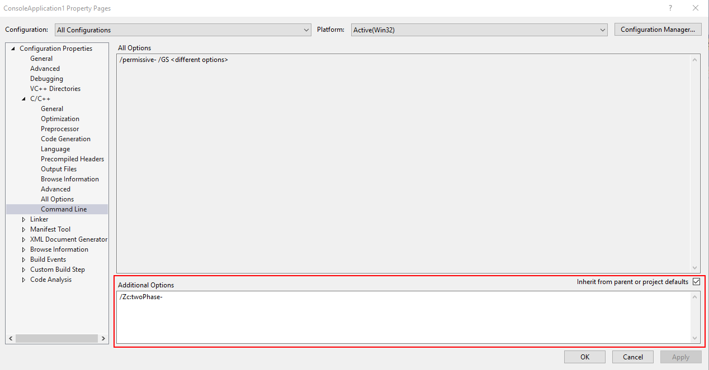

# Compiling

## 4. Project Compiler Settings - Runtime

If later on there is a error message, warning about the wrong .Net Version, then do the following:
>In the Solution Explorer on the right hand side open the project settings with a right-click on the main project node.
Follow the options ``Configuration Properties -> Advanced -> C++/CLI Properties``.

In the option one below hit the option ``edit``.

In the new window write the version, we memorized. In the case of this tutorial it was ``4.7``.

After the settings hit apply, but leave the window open, as we still need for the next step.

## Compiler Settings - compiler behavior

In the project settings select ``Configuration Properties -> C/C++ -> Command Line``
Paste the following command in the window ``Additional Options`` at the bottom.
````
/Zc:twoPhase-
````
Resources for deeper explanations can be found [here](https://docs.microsoft.com/en-us/cpp/build/reference/zc-twophase?view=vs-2019).



## Start the Compiler
In the editor press the Debugger-button on the top of the editor window.


Now the compiler started and should run through, and run though the main method. If not check this [link](common_warnings.md).
